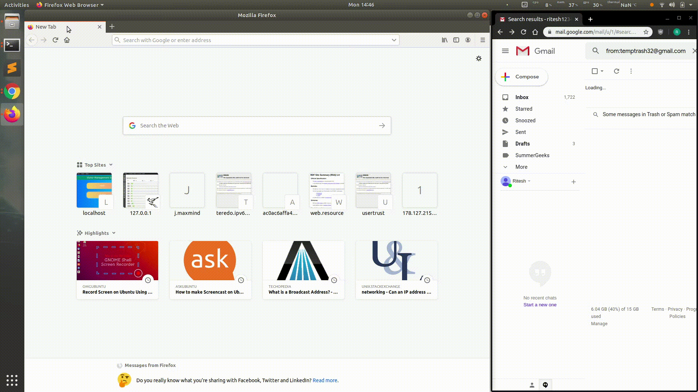
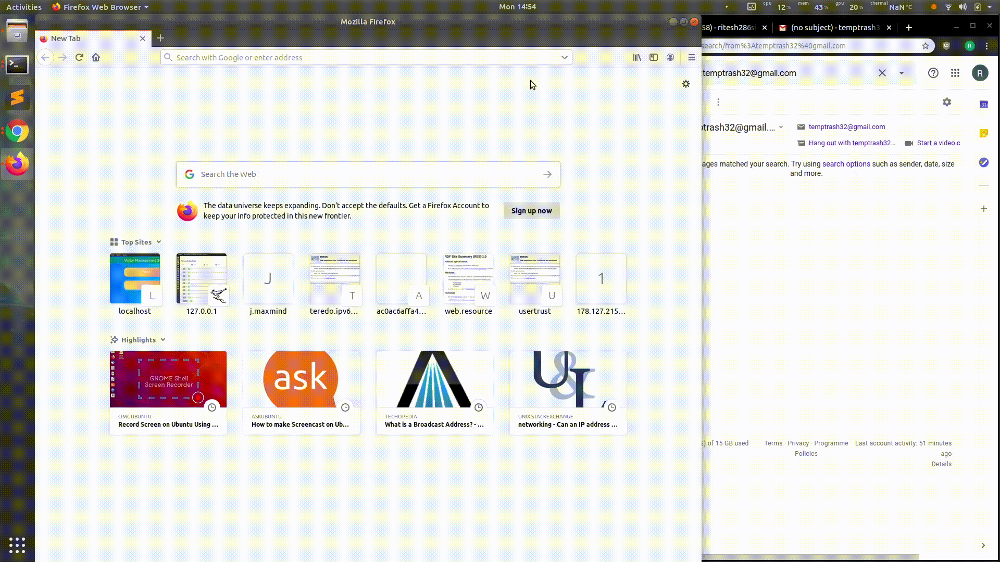

#Visitor Management System

A Web based Application to help keep track of Visitors.

##Tech Stack Used

* [Mongoose](https://mongoosejs.com/) - MongoDB object modeling tool.
* [ReactJS](https://reactjs.org/) - JavaScript library for building user interfaces
* [Express](https://expressjs.com/) - Express is a web application framework for Node.js
* [Node,js](https://nodejs.org/en/about/) - JavaScript RE that executes JavaScript code outside of a browser

##Demo Gifs

* Host Interface

*Guest Interface
Guest Enters:-

Guest Exits:-

